# BÀI THỰC HÀNH 1  
## MONGODB – CRUD Operation  

---

# Bài 1: Thiết lập môi trường

## 1.1 Đăng ký tài khoản MongoDB Atlas và tạo cluster miễn phí trên dịch vụ đám mây


---

## 1.2 Tìm nạp dữ liệu mẫu trên MongoDB Atlas vào cluster

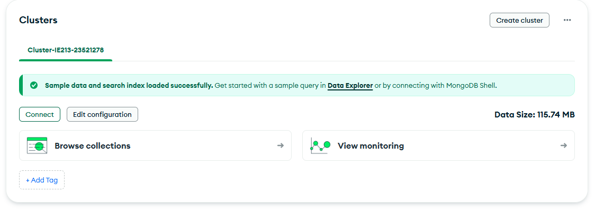

---

## 1.3 Cài đặt MongoDB Compass trên máy tính

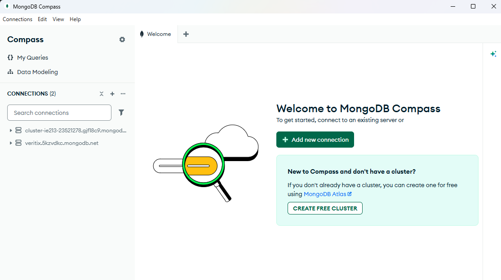

---

## 1.4 Kết nối MongoDB Compass với cluster đã tạo trên MongoDB Atlas

### Bước 1: Chọn **Connect** để lấy Connection String

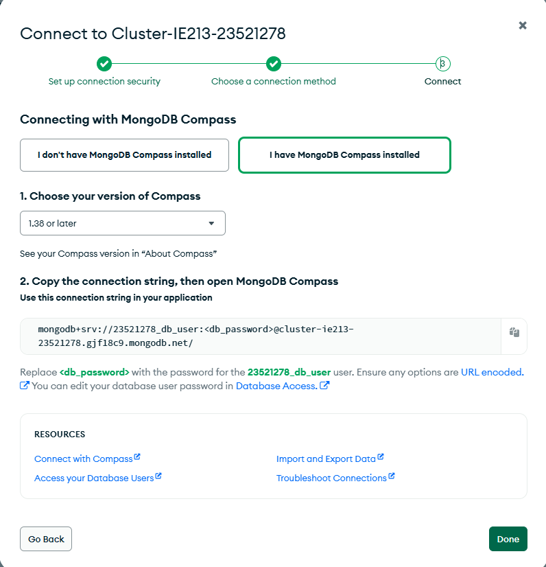

### Bước 2: Nhập chuỗi đã sao chép vào MongoDB Compass

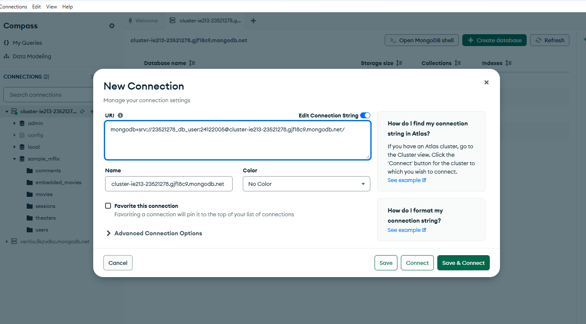

### Bước 3: Kết nối thành công

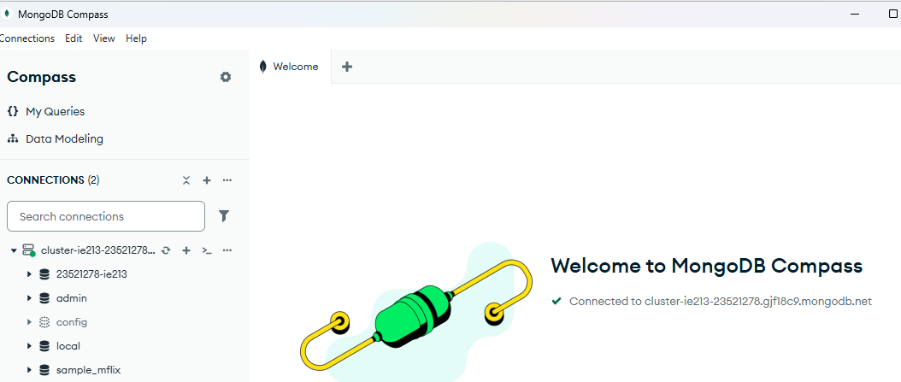

---

# Bài 2: CRUD Operation

Mở cửa sổ Mongosh để tiến hành làm bài:

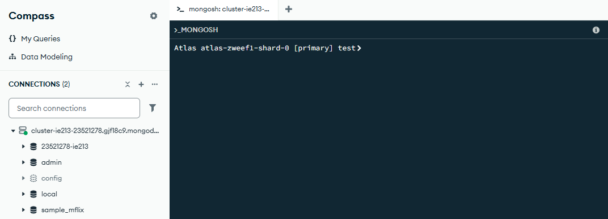

---

## 2.1 Tạo cơ sở dữ liệu có tên MSSV-IE213  
(MSSV là 23521278)

Script:

```javascript
use 23521278-ie213
```

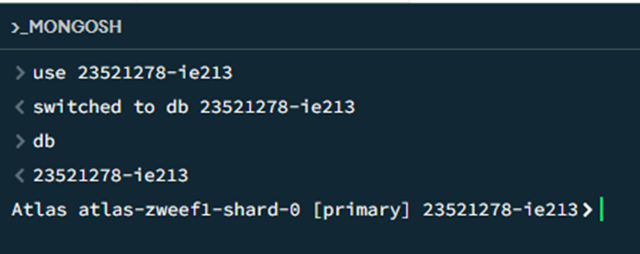

---

## 2.2 Thêm các document vào collection `employees`

Script:

```javascript
db.employees.insertMany([
{"id":1,"name":{"first":"John","last":"Doe"},"age":48},
{"id":2,"name":{"first":"Jane","last":"Doe"},"age":16},
{"id":3,"name":{"first":"Alice","last":"A"},"age":32},
{"id":4,"name":{"first":"Bob","last":"B"},"age":64}
])
```

Thêm dữ liệu:

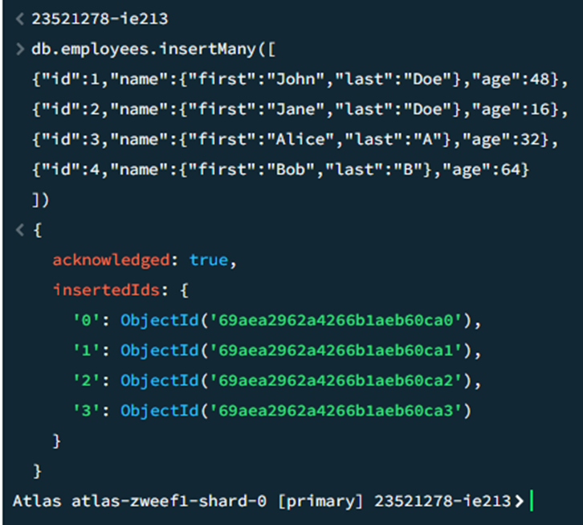

Kiểm tra dữ liệu trong collection:

```javascript
db.employees.find()
```

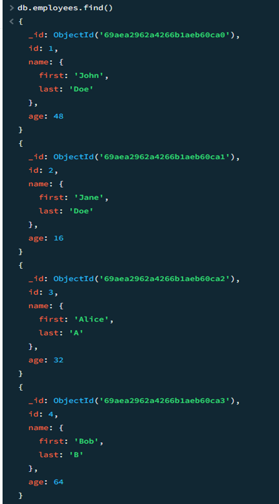

---

## 2.3 Biến trường `id` thành duy nhất (unique)

Script:

```javascript
db.employees.createIndex({id:1},{unique:true})
```

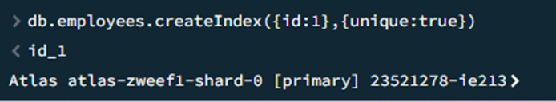

Kiểm tra bằng cách thêm document có `id = 1`

```javascript
db.employees.insertOne({"id":1})
```

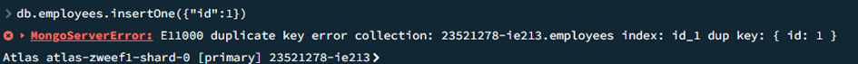

→ Báo lỗi vì **trùng id**.

---

## 2.4 Tìm document có firstname = John và lastname = Doe

Script:

```javascript
db.employees.find({
"name.first":"John",
"name.last":"Doe"
})
```

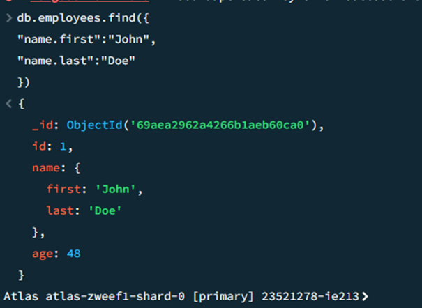

---

## 2.5 Tìm những người có tuổi > 30 và < 60

Script:

```javascript
db.employees.find({
  $and: [
    { age: { $gt: 30 } },
    { age: { $lt: 60 } }
  ]
})
```

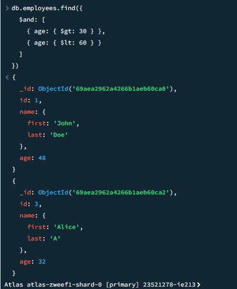

---

## 2.6 Thêm document mới vào collection

Script:

```javascript
db.employees.insertMany([
{"id":5,"name":{"first":"Rooney","middle":"K","last":"A"},"age":30},
{"id":6,"name":{"first":"Ronaldo","middle":"T","last":"B"},"age":60}
])
```

Thêm dữ liệu:

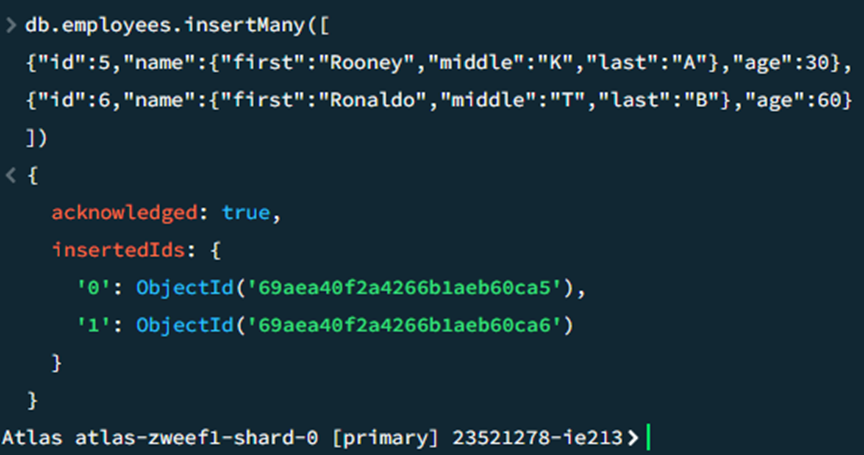

Tìm document có **middle name**

```javascript
db.employees.find({
"name.middle":{$exists:true}
})
```

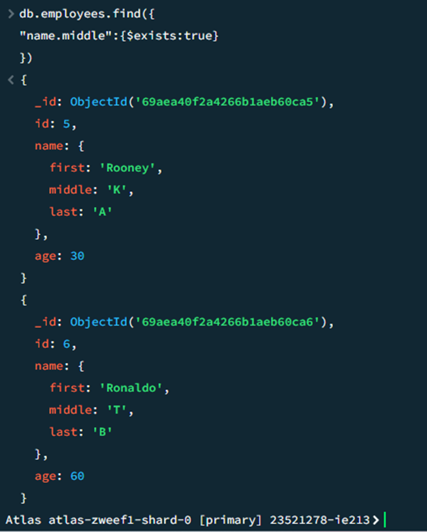

---

## 2.7 Xoá middle name khỏi các document

Script:

```javascript
db.employees.updateMany(
{ "name.middle": { $exists: true } },
{ $unset: { "name.middle": null } }
)
```

Thực hiện xoá:

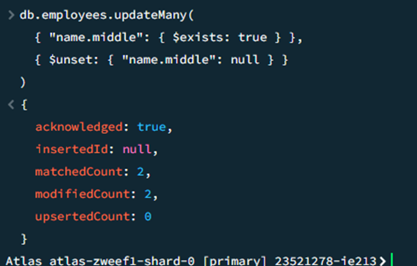

Kiểm tra lại:

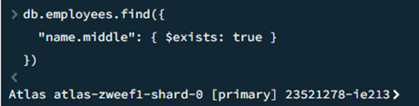

→ Không còn document nào có **middle name**.

---

## 2.8 Thêm trường `organization: "UIT"` vào tất cả document

Script:

```javascript
db.employees.updateMany(
{},
{$set:{organization:"UIT"}}
)
```

Thêm trường organization:

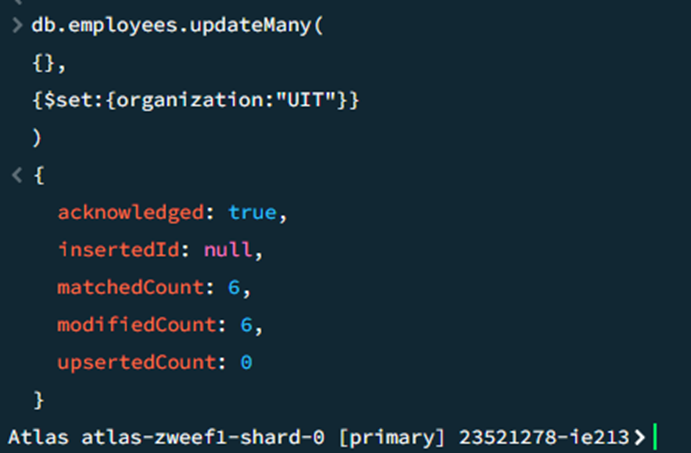

Kiểm tra:

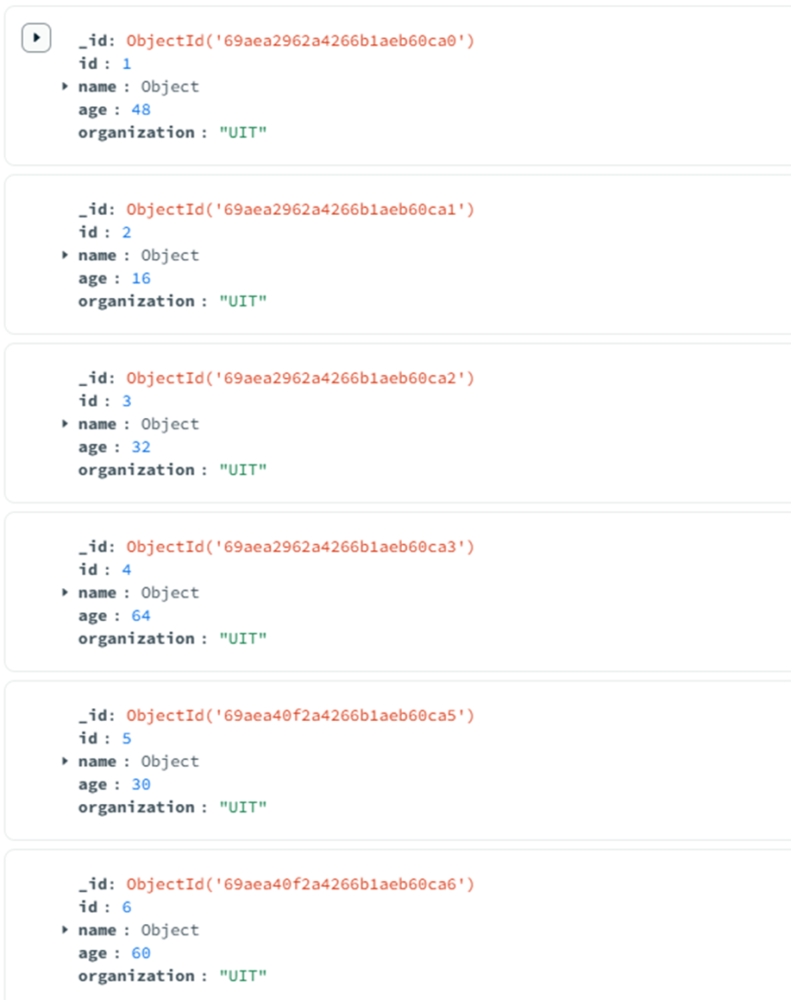

---

## 2.9 Thay đổi organization của nhân viên có id 5 và 6 thành "USSH"

Script:

```javascript
db.employees.updateMany(
{id:{$in:[5,6]}},
{$set:{organization:"USSH"}}
)
```

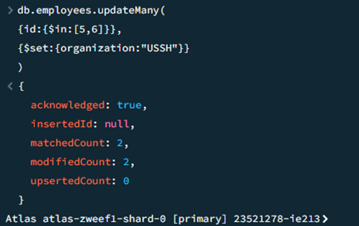

Kiểm tra:

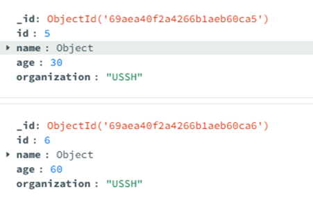

---

## 2.10 Tính tổng tuổi và tuổi trung bình của nhân viên theo organization

Script:

```javascript
db.employees.aggregate([
{
$group:{
_id:"$organization",
totalAge:{$sum:"$age"},
avgAge:{$avg:"$age"}
}
}
])
```

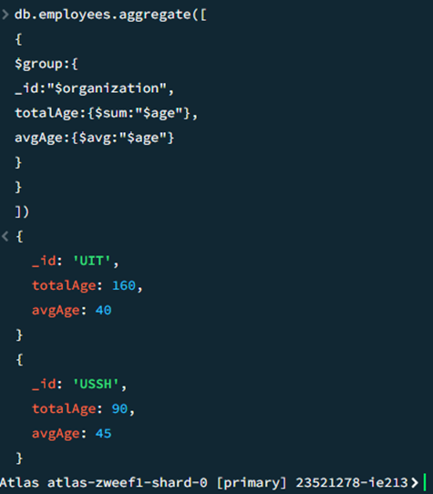

---

---

# Kết luận

Qua bài thực hành này, em đã làm quen với việc sử dụng **MongoDB Atlas** và **MongoDB Compass** để quản lý cơ sở dữ liệu.  

Các phần chính của MongoDB được thực hiện bao gồm:
- Tạo cơ sở dữ liệu và collection.
- Thêm dữ liệu vào collection.
- Truy vấn dữ liệu theo điều kiện.
- Cập nhật và chỉnh sửa dữ liệu.
- Xóa trường dữ liệu không cần thiết.
- Cách thiết lập **unique index** cho một trường dữ liệu.
- Cách sử dụng các toán tử truy vấn trong MongoDB.
- Cách sử dụng **Aggregation Pipeline** để tính tổng và trung bình theo nhóm.

→ Nắm được các thao tác CRUD cơ bản trong MongoDB và cách làm việc với cơ sở dữ liệu NoSQL.