# BÀI THỰC HÀNH 3  
## HOÀN THIỆN BACK-END CHO ỨNG DỤNG MINH HOẠ  

---


# Bài 1: Thiết lập định tuyến cho các thao tác với review
Việc này cần thực hiện trong tệp tin `movies.route.js`
- **1.1** Định tuyến này sẽ có đường dẫn cuối cùng là `/review`
- **1.2** Thiết lập định tuyến thêm review (`POST`)
- **1.3** Thiết lập định tuyến sửa review (`PUT`)
- **1.4** Thiết lập định tuyến xoá review (`DELETE`)

Script (`api/movies.route.js`):
```javascript
import express from 'express';
import MoviesController from './movies.controller.js';
import ReviewsController from './reviews.controller.js';

const router = express.Router();

router.route('/').get(MoviesController.apiGetMovies);

router
    .route('/review')
    .post(ReviewsController.apiPostReview)
    .put(ReviewsController.apiUpdateReview)
    .delete(ReviewsController.apiDeleteReview);

export default router;
```

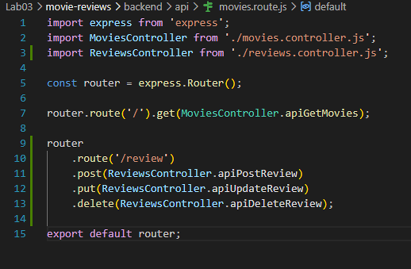

---

# Bài 2: Thiết lập Controller cho review

## 2.1 Tạo tệp tin reviews.controller.js
Tạo tệp tin `reviews.controller.js` trong thư mục `api` chứa class `ReviewsController` để quản lý các yêu cầu liên quan đến review.

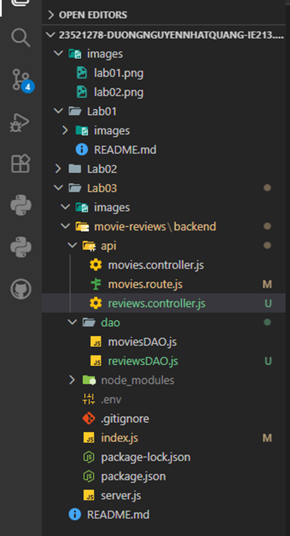

## 2.2 Import ReviewsDAO
Import nội dung từ tệp tin `reviewsDAO.js` để gọi tới các hàm tương tác dữ liệu.

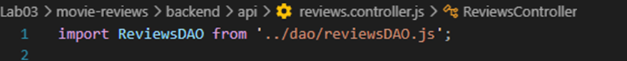

## 2.3 Tạo phương thức apiPostReview()
Quản lý yêu cầu gửi từ máy khách để thêm review vào database.

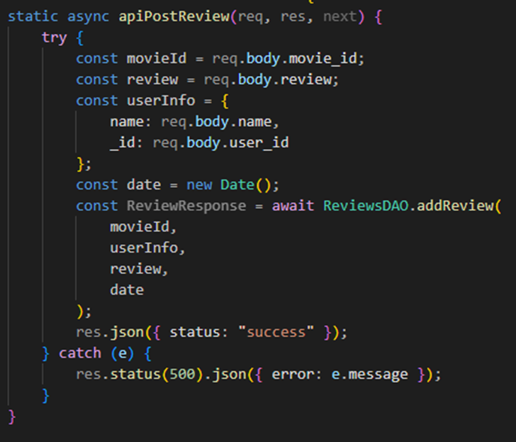

## 2.4 Tạo phương thức apiUpdateReview()
Quản lý yêu cầu sửa review. Bắt buộc id user gửi lên phải khớp với id của user đã tạo ra review đó.

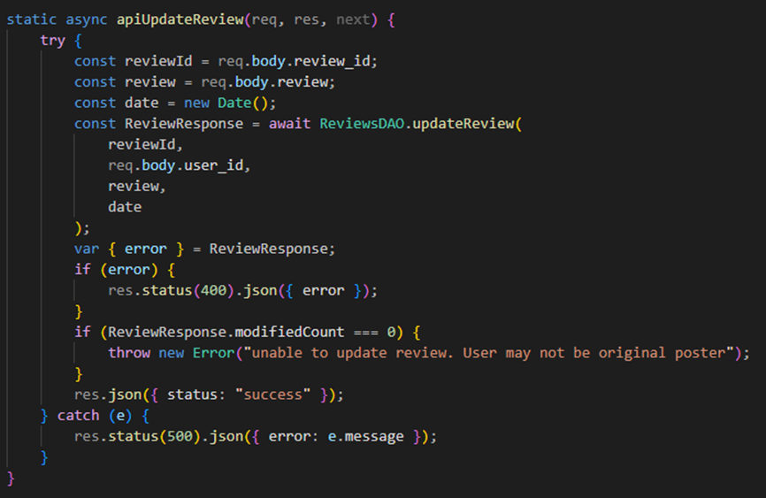

## 2.5 Tạo phương thức apiDeleteReview()
Quản lý yêu cầu xoá review khỏi database.

Script tổng hợp (`api/reviews.controller.js`):
```javascript
import ReviewsDAO from '../dao/reviewsDAO.js';

export default class ReviewsController {
    static async apiPostReview(req, res, next) {
        try {
            const movieId = req.body.movie_id;
            const review = req.body.review;
            const userInfo = {
                name: req.body.name,
                _id: req.body.user_id
            };
            const date = new Date();
            const ReviewResponse = await ReviewsDAO.addReview(
                movieId, userInfo, review, date
            );
            res.json({ status: "success" });
        } catch (e) {
            res.status(500).json({ error: e.message });
        }
    }

    static async apiUpdateReview(req, res, next) {
        try {
            const reviewId = req.body.review_id;
            const review = req.body.review;
            const date = new Date();
            const ReviewResponse = await ReviewsDAO.updateReview(
                reviewId, req.body.user_id, review, date
            );
            var { error } = ReviewResponse;
            if (error) {
                res.status(400).json({ error });
            }
            if (ReviewResponse.modifiedCount === 0) {
                throw new Error("unable to update review. User may not be original poster");
            }
            res.json({ status: "success" });
        } catch (e) {
            res.status(500).json({ error: e.message });
        }
    }

    static async apiDeleteReview(req, res, next) {
        try {
            const reviewId = req.body.review_id;
            const userId = req.body.user_id;
            const ReviewResponse = await ReviewsDAO.deleteReview(
                reviewId, userId
            );
            res.json({ status: "success" });
        } catch (e) {
            res.status(500).json({ error: e.message });
        }
    }
}
```

---

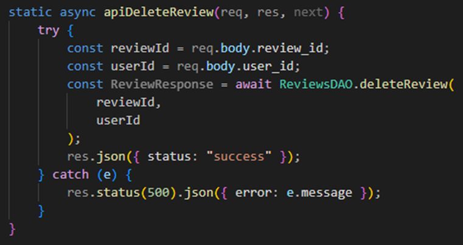

# Bài 3: Thiết lập DAO cho reviews

## 3.1 Khởi tạo reviewsDAO.js
Trong thư mục `dao` tạo tệp tin `reviewsDAO.js`, import package `mongodb` và tạo biến tham chiếu `ObjectId`.

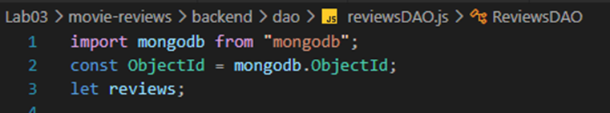

## 3.2 Tạo phương thức injectDB()
Kết nối tới collection `reviews` trên database.

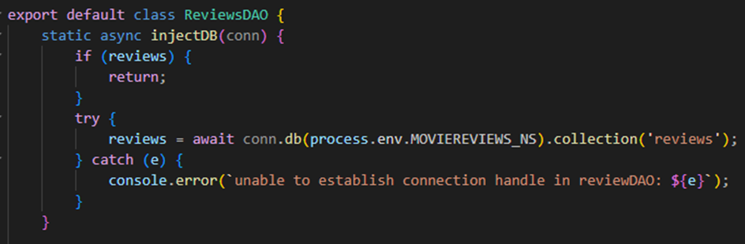


## 3.3 Tạo phương thức addReview()
Thêm review vào database với phương thức `insertOne()`. Chuỗi `movieId` phải được ép kiểu thành `ObjectId`.

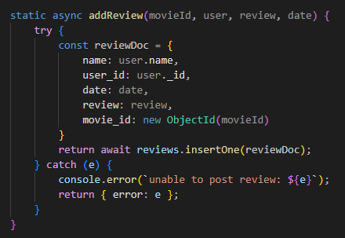

## 3.4 Tạo phương thức updateReview()
Sửa review trên database với `updateOne()`

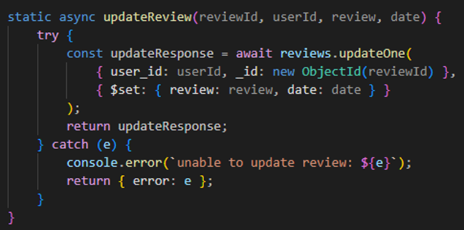  

## 3.5 Tạo phương thức deleteReview()
Xoá review trên database với `deleteOne()`.
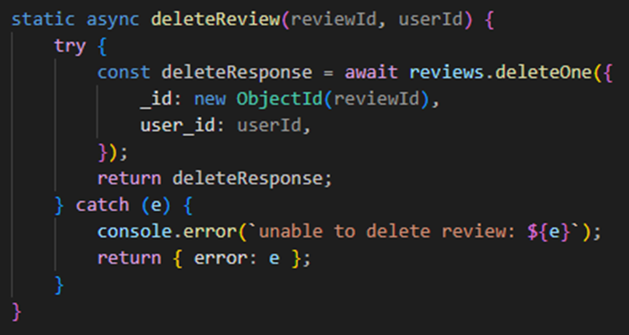

Script DAO (`dao/reviewsDAO.js`):
```javascript
import mongodb from "mongodb";
const ObjectId = mongodb.ObjectId;
let reviews;

export default class ReviewsDAO {
    static async injectDB(conn) {
        if (reviews) { return; }
        try {
            reviews = await conn.db(process.env.MOVIEREVIEWS_NS).collection('reviews');
        } catch (e) {
            console.error(`unable to establish connection handle in reviewDAO: ${e}`);
        }
    }

    static async addReview(movieId, user, review, date) {
        try {
            const reviewDoc = {
                name: user.name,
                user_id: user._id,
                date: date,
                review: review,
                movie_id: new ObjectId(movieId)
            }
            return await reviews.insertOne(reviewDoc);
        } catch (e) {
            console.error(`unable to post review: ${e}`);
            return { error: e };
        }
    }

    static async updateReview(reviewId, userId, review, date) {
        try {
            const updateResponse = await reviews.updateOne(
                { user_id: userId, _id: new ObjectId(reviewId) },
                { $set: { review: review, date: date } }
            );
            return updateResponse;
        } catch (e) {
            console.error(`unable to update review: ${e}`);
            return { error: e };
        }
    }

    static async deleteReview(reviewId, userId) {
        try {
            const deleteResponse = await reviews.deleteOne({
                _id: new ObjectId(reviewId),
                user_id: userId,
            });
            return deleteResponse;
        } catch (e) {
            console.error(`unable to delete review: ${e}`);
            return { error: e };
        }
    }
}
```

*Lưu ý:* Bổ sung gọi hàm `await ReviewsDAO.injectDB(client);` vào file `index.js` trước khi khởi động máy chủ.

## 3.6 Thử nghiệm các API bằng Postman
Sử dụng mã số sinh viên `23521278` làm `user_id` để tiến hành test các Request POST (Thêm), PUT (Sửa) và DELETE (Xoá).


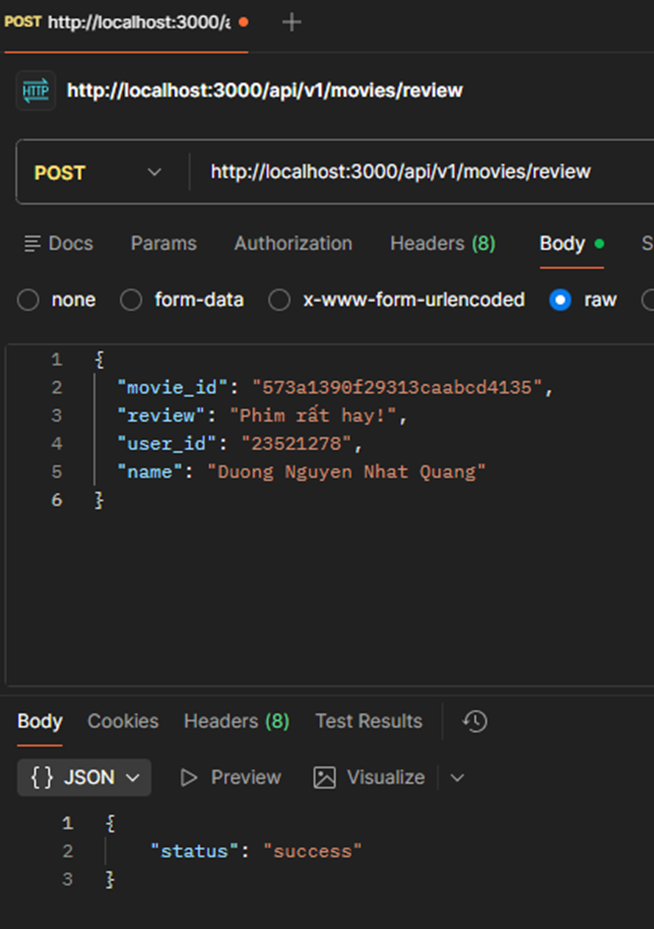

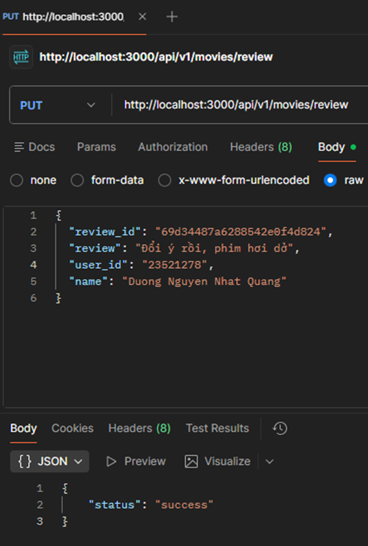

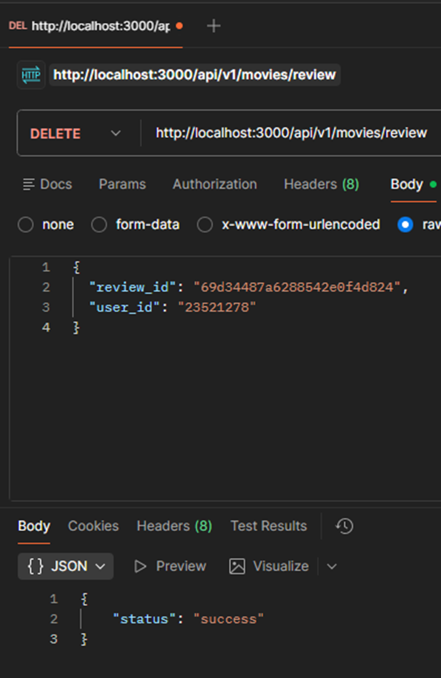

---

# Bài 4: Hoàn thành back-end cho ứng dụng minh họa

## 4.1 Thêm 2 định tuyến mới
Định tuyến lấy chi tiết một phim (dựa trên ID) và định tuyến lấy danh sách các nhãn dán rating.

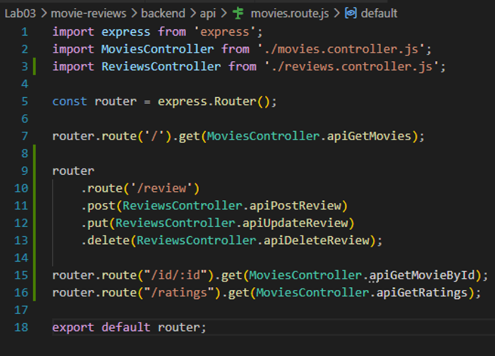

Cập nhật route (`api/movies.route.js`):
```javascript
router.route("/id/:id").get(MoviesController.apiGetMovieById);
router.route("/ratings").get(MoviesController.apiGetRatings);
```

## 4.2 Cập nhật Controller cho Movie
Thêm 2 phương thức `apiGetMovieById()` và `apiGetRatings()` vào `movies.controller.js`.

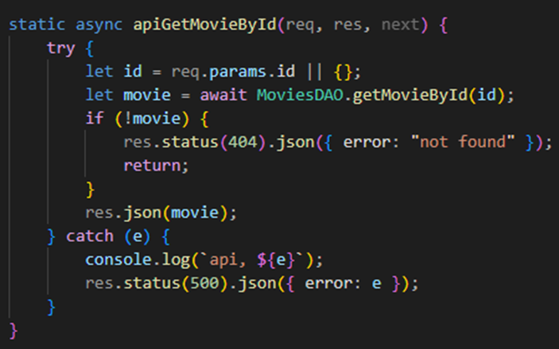

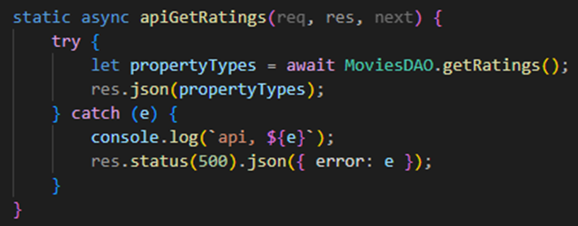

## 4.3 Cập nhật DAO cho Movie
Thêm 2 phương thức `getMovieById()` và `getRatings()` vào `moviesDAO.js`. Sử dụng toán tử `$match` và `$lookup` (chức năng như khoá ngoại trong SQL) để kết hợp dữ liệu từ collection `movies` và `reviews`.

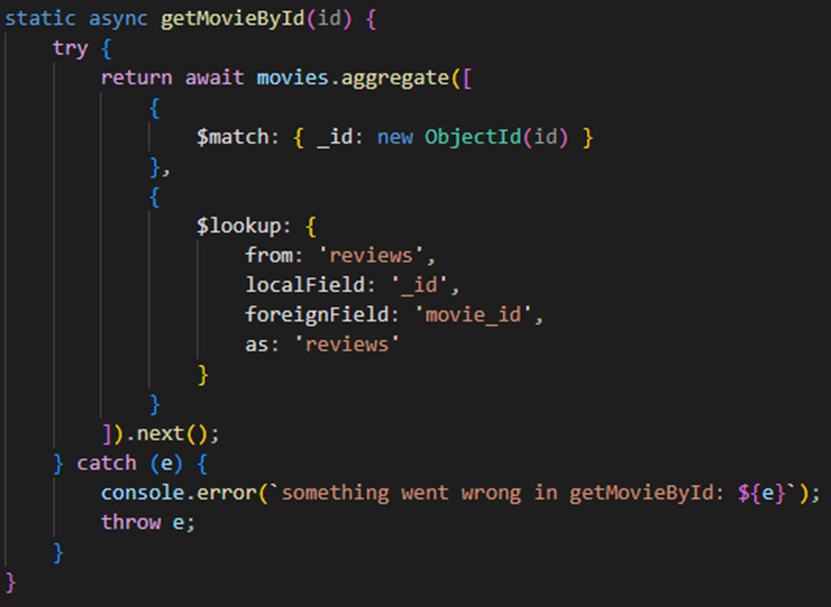

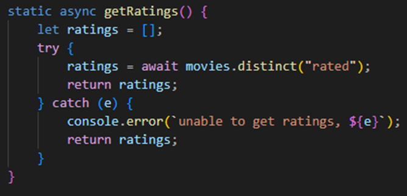

## 4.4 Thử nghiệm các API vừa tạo
Sử dụng Postman để test chức năng lấy Rating và lấy chi tiết một bộ phim có chứa mảng reviews ở bên trong.

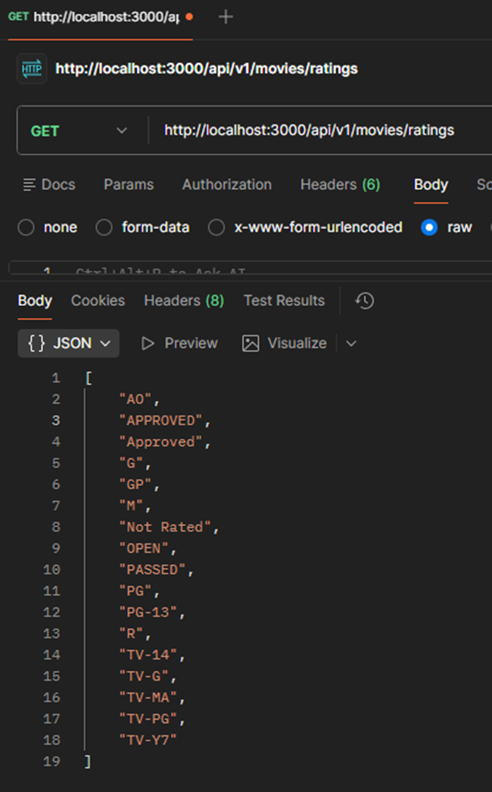
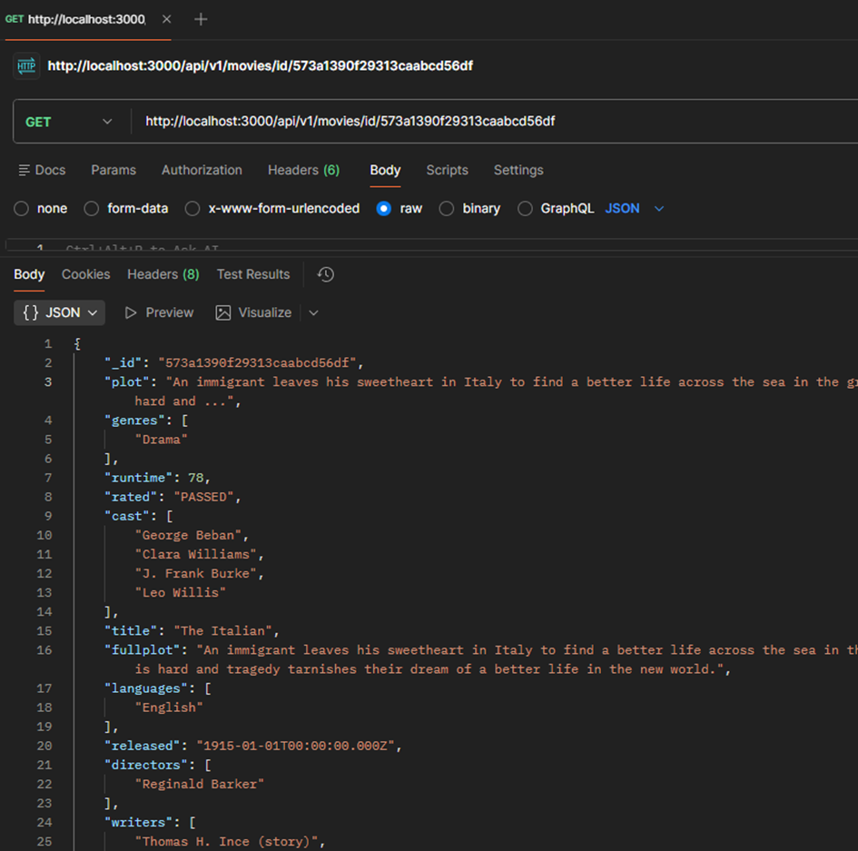


---

# Kết luận
Qua bài thực hành này, dự án Backend đã được hoàn thiện với các chức năng chính:
- Xây dựng luồng Thêm/Sửa/Xóa (POST, PUT, DELETE) cho Collection Review, kèm kiểm tra quyền thông qua `user_id`.
- Tương tác chuyên sâu với MongoDB: ép kiểu `ObjectId`, sử dụng `insertOne`, `updateOne`, `deleteOne`.
- Tích hợp và gom nhóm dữ liệu (Aggregation): Ứng dụng thành thạo `$lookup` để join dữ liệu giữa bảng `movies` và `reviews`.
- Sử dụng hàm `distinct` để lấy các giá trị duy nhất (Ratings) từ một trường.
- Có sử dụng AI hỗ trợ để tạo và tổ chức file README.md, giúp trình bày cấu trúc rõ ràng, chuyên nghiệp.