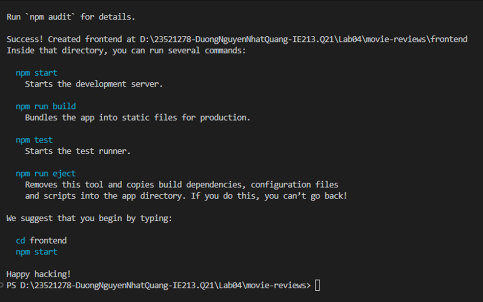
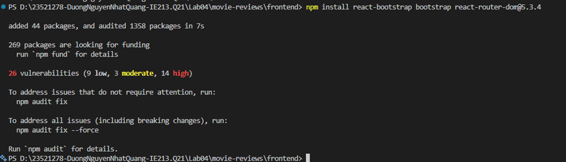
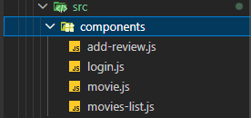
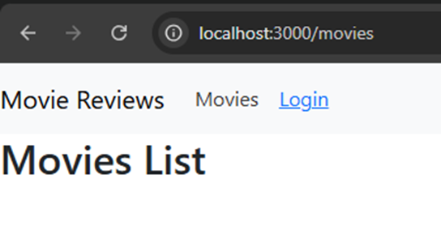

# BÀI THỰC HÀNH 4  
## THIẾT LẬP FRONTEND VỚI REACTJS  

---

# Bài 1: Thiết lập nơi làm việc với frontend của dự án

## 1.1 Tạo template frontend với React
Sử dụng công cụ `create-react-app` để khởi tạo dự án React cơ bản trong thư mục dự án[cite: 5, 8].

Script:
```bash
npx create-react-app frontend
```



## 1.2 Cài đặt các package hỗ trợ
Cài đặt thư viện Bootstrap để xây dựng giao diện và React Router Dom để quản lý định tuyến chuyển trang[cite: 15, 17, 21].

Script:
```bash
cd frontend
npm install react-bootstrap bootstrap react-router-dom@5.3.4
```



---

# Bài 2: Xây dựng Navigation Header bar

## 2.1 Khởi tạo các Component cơ bản
Tạo thư mục `components` trong thư mục `src` và khởi tạo các file: `movies-list.js`, `movie.js`, `add-review.js`, `login.js`[cite: 41, 47, 49].

Cấu trúc thư mục:
- `src/components/movies-list.js`
- `src/components/movie.js`
- `src/components/add-review.js`
- `src/components/login.js`



## 2.2 & 2.3 Thiết lập Navbar trong App.js
Sử dụng Navbar từ thư viện `react-bootstrap` và tích hợp `useState` để quản lý trạng thái đăng nhập của người dùng[cite: 50, 82, 94].

Script (Khung sườn `App.js`):
```javascript
import React from "react";
import { Switch, Route, Link } from "react-router-dom";
import 'bootstrap/dist/css/bootstrap.min.css';
import Nav from 'react-bootstrap/Nav';
import Navbar from 'react-bootstrap/Navbar';

function App() {
  const [user, setUser] = React.useState(null);

  async function login(user = null) { setUser(user); }
  async function logout() { setUser(null); }

  return (
    <div className="App">
      <Navbar bg="light" expand="lg">
        <Navbar.Brand href="#home">Movie Reviews</Navbar.Brand>
        <Nav className="me-auto">
          <Nav.Link as={Link} to={"/movies"}>Movies</Nav.Link>
          <Nav.Link>
            {user ? (
              <a onClick={logout} href="#">Logout User</a>
            ) : (
              <Link to={"/login"}>Login</Link>
            )}
          </Nav.Link>
        </Nav>
      </Navbar>
      {/* Routes will be here */}
    </div>
  );
}
```

# Bài 3: Thiết lập các định tuyến (Routing)

## 3.1 & 3.2 Cấu hình thẻ Switch và Route
Định nghĩa các đường dẫn tương ứng với 4 component đã tạo để người dùng có thể di chuyển giữa các trang[cite: 128, 131, 136].

Script (`App.js` hoàn chỉnh):
```javascript
<Switch>
  <Route exact path={["/", "/movies"]} component={MoviesList} />
  <Route 
    path="/movies/:id/review" 
    render={(props) => (
      <AddReview {...props} user={user} />
    )} 
  />
  <Route 
    path="/movies/:id/" 
    render={(props) => (
      <Movie {...props} user={user} />
    )} 
  />
  <Route 
    path="/login" 
    render={(props) => (
      <Login {...props} login={login} />
    )} 
  />
</Switch>
```

## 3.3 Cấu hình BrowserRouter (Fix lỗi Link outside Router)
Bọc ứng dụng `<App />` trong `<BrowserRouter>` tại file `index.js` để kích hoạt tính năng định tuyến.

Script (`src/index.js`):
```javascript
import { BrowserRouter } from 'react-router-dom';

const root = ReactDOM.createRoot(document.getElementById('root'));
root.render(
  <React.StrictMode>
    <BrowserRouter>
      <App />
    </BrowserRouter>
  </React.StrictMode>
);
```

---

# Kết quả thực hiện

Giao diện ứng dụng khi chạy thực tế trên trình duyệt:

- **Trang chủ (Movies List):**


- **Trang Đăng nhập (Login):**


---

# Kết luận
Qua bài thực hành này, em đã hoàn thành các nội dung:
- Khởi tạo thành công một dự án ReactJS hoàn chỉnh[cite: 8].
- Cài đặt và cấu hình các thư viện bên thứ ba như Bootstrap và React Router Dom[cite: 21, 32].
- Tổ chức mã nguồn Frontend theo hướng Component-based (tách riêng các màn hình vào thư mục `components`)[cite: 47].
- Quản lý trạng thái ứng dụng (State Management) cơ bản bằng React Hook `useState` cho tính năng Login/Logout[cite: 83].
- Thiết lập hệ thống định tuyến phức tạp (Dynamic Routing) sử dụng `Switch`, `Route` và truyền dữ liệu qua `props`[cite: 136, 194].
- Có sử dụng AI để hỗ trợ tổ chức file README.md đúng format của các Lab trước.