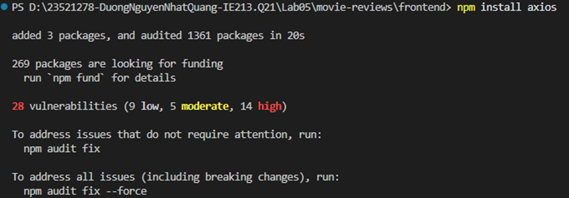
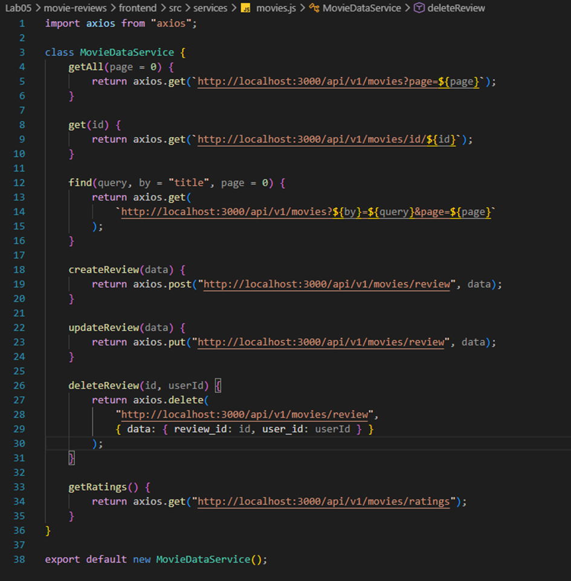
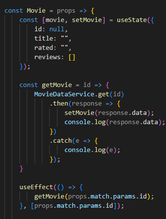
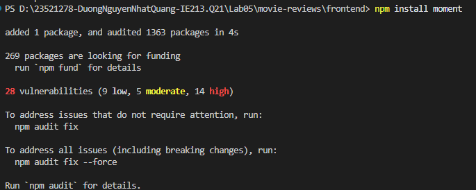
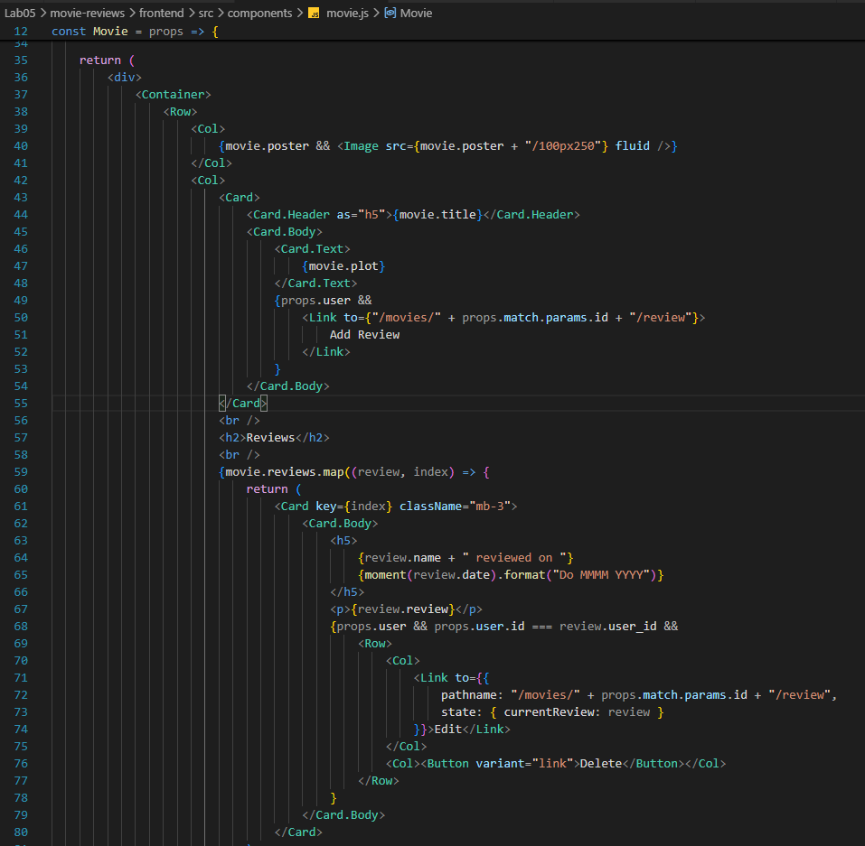
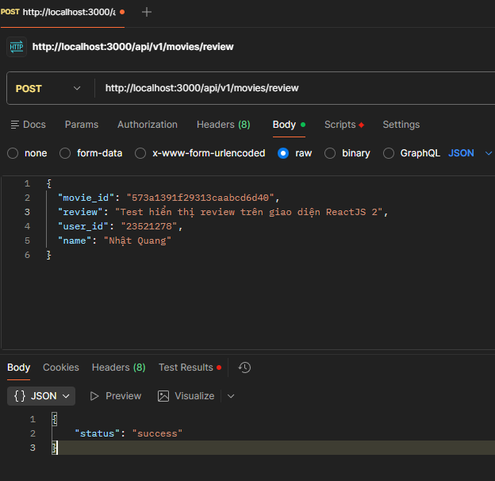
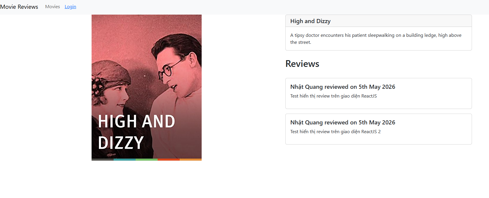

# BÀI THỰC HÀNH 5
## XÂY DỰNG FRONTEND VỚI REACTJS (TIẾP THEO)

---

# Bài 1: Kết nối tới Backend

## 1.1 Cài đặt Axios
Cài đặt thư viện `axios` để hỗ trợ gọi các API từ Frontend xuống Backend.

Script:
```bash
npm install axios
```



## 1.2 & 1.3 Tạo lớp dịch vụ MovieDataService
Tạo thư mục `services` và file `movies.js` để định nghĩa các phương thức gọi API (GET, POST, PUT, DELETE) tương ứng với các endpoint của Backend (port 3000).

Script (`src/services/movies.js`):
```javascript
import axios from "axios";

class MovieDataService {
    getAll(page = 0) { return axios.get(`http://localhost:3000/api/v1/movies?page=${page}`); }
    get(id) { return axios.get(`http://localhost:3000/api/v1/movies/id/${id}`); }
    find(query, by = "title", page = 0) { return axios.get(`http://localhost:3000/api/v1/movies?${by}=${query}&page=${page}`); }
    createReview(data) { return axios.post("http://localhost:3000/api/v1/movies/review", data); }
    updateReview(data) { return axios.put("http://localhost:3000/api/v1/movies/review", data); }
    deleteReview(id, userId) { return axios.delete("http://localhost:3000/api/v1/movies/review", { data: { review_id: id, user_id: userId } }); }
    getRatings() { return axios.get("http://localhost:3000/api/v1/movies/ratings"); }
}
export default new MovieDataService();
```



---

# Bài 2: Xây dựng Movies List Component

## 2.1 - 2.5 Hoàn thiện màn hình Danh sách phim
Cập nhật file `movies-list.js` để tích hợp form tìm kiếm (theo tên và rating) và hiển thị danh sách phim dưới dạng lưới các thẻ `<Card>` của Bootstrap.

Sử dụng `useState` để quản lý trạng thái và `useEffect` để tự động gọi API lấy danh sách phim, danh sách rating khi Component vừa render xong.



---

# Bài 3 & Bài 4: Hiển thị chi tiết trang Movie và Reviews

## 4.1 Cài đặt thư viện xử lý thời gian
Cài đặt `momentjs` để định dạng thời gian của các bài đánh giá (reviews) cho trực quan.

Script:
```bash
npm install moment
```



## 3.1 - 4.2 Hoàn thiện màn hình Chi tiết phim
Cập nhật file `movie.js` để gọi API lấy thông tin chi tiết một bộ phim dựa vào ID trên URL. 
Render poster phim, nội dung cốt truyện (plot) và danh sách các đánh giá ở bên dưới.

*Lưu ý: Do sử dụng Bootstrap 5, Component `<Media>` đã bị loại bỏ, thay vào đó sử dụng `<Card>` để bọc các review lại giúp giao diện vẫn hiển thị chuẩn xác.*



## 4.2 Thêm Review thông qua Postman
Sử dụng công cụ Postman gửi một HTTP POST request với body dạng JSON để thêm một review mới vào CSDL, sau đó kiểm tra sự xuất hiện của review này trên giao diện UI đã được format thời gian bằng `moment`.



---

# Kết quả thực hiện

Giao diện ứng dụng khi chạy thực tế trên trình duyệt:

- **Trang danh sách phim (kèm Form tìm kiếm):**


- **Trang chi tiết phim (hiển thị Review):**


---

# Kết luận
Qua bài thực hành này, em đã hoàn thành các nội dung:
- Áp dụng thành công thư viện `axios` để giao tiếp giữa Frontend (React) và Backend (Node.js/Express).
- Quản lý state của Component phức tạp bằng các React Hooks (`useState`, `useEffect`) để tự động fetch dữ liệu.
- Xây dựng form tìm kiếm động, tự động cập nhật danh sách hiển thị dựa trên kết quả trả về từ API.
- Tổ chức hiển thị dữ liệu dạng lưới (Grid) và dạng danh sách bằng các Component của React-Bootstrap như `<Card>`, `<Row>`, `<Col>`, `<Container>`.
- Định dạng dữ liệu thời gian với `momentjs` và xử lý logic hiển thị các nút thao tác (Edit/Delete) dựa trên quyền của người dùng hiện tại.