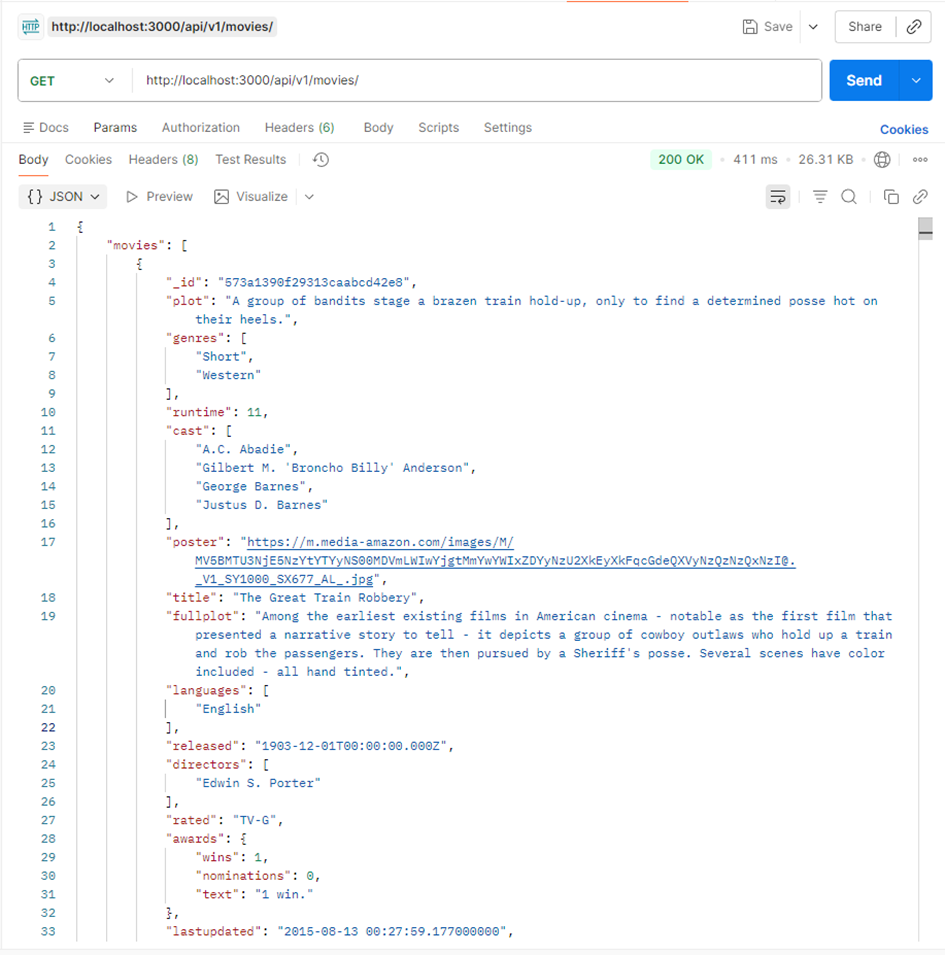
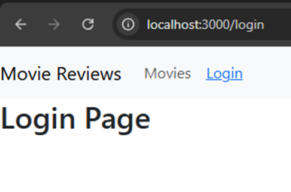
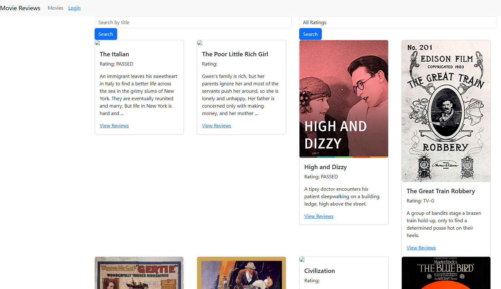

# Thông tin sinh viên

- **Họ và tên:** Dương Nguyễn Nhật Quang  
- **MSSV:** 23521278  
- **Lớp:** IE213.Q21  

---

# Danh sách các Lab

## Lab01
**Nội dung:**  
Tiến hành cài đặt MongoDB và thực hiện một số thao tác CRUD cơ bản.

**Cách chạy:**  
- Dùng Mongosh của MongoDB Compass. 
- Copy và paste script trong README.md ở thư mục Lab01 để chạy.

**Trạng thái:** Đã hoàn thành tất cả nội dung.

---

## Lab02
**Nội dung:** Thiết lập backend với Node.js và ExpressJS.

**Cách chạy:**   
1. Mở terminal, điều hướng vào thư mục backend: `cd Lab02/movie-reviews/backend`.  
2. Chạy lệnh `npm install` để cài đặt các dependency cần thiết (đã được định nghĩa trong `package.json`).  
3. Đảm bảo file `.env` đã được đặt ở thư mục backend và cấu hình chuỗi kết nối `MOVIEREVIEWS_DB_URI` và `PORT=3000`.  
4. Chạy lệnh `npm start` (hoặc `node index.js`) để khởi động máy chủ web. Terminal sẽ báo `Server is running on port: 3000`.  
5. Sử dụng Postman, tạo một HTTP GET Request tới đường dẫn `http://localhost:3000/api/v1/movies` để kiểm tra dữ liệu JSON trả về.  

**Trạng thái:** Đã hoàn thành tất cả nội dung.

---

## Lab03
**Nội dung:** Hoàn thiện backend cho ứng dụng minh hoạ. Xây dựng các chức năng Thêm, Sửa, Xoá (CRUD) cho đánh giá (review) phim. Viết API lấy thông tin chi tiết của một bộ phim (kèm các review) và danh sách các nhãn dán xếp hạng (rating).

**Cách chạy:** 
1. Mở terminal, điều hướng vào thư mục backend: `cd Lab03/movie-reviews/backend`.  
2. Chạy lệnh `npm install` để cài đặt các dependency.  
3. Đảm bảo file `.env` chứa chuỗi kết nối database chính xác.  
4. Chạy lệnh `npm start` để khởi động máy chủ web.  
5. Sử dụng Postman để kiểm thử các API:
   - **Review (POST, PUT, DELETE):** Gửi request tới `http://localhost:3000/api/v1/movies/review` kèm theo Body JSON.
   - **Chi tiết phim (GET):** Gửi request tới `http://localhost:3000/api/v1/movies/id/<movie_id>`.
   - **Ratings (GET):** Gửi request tới `http://localhost:3000/api/v1/movies/ratings`.

**Trạng thái:** Đã hoàn thành tất cả nội dung.

---

## Lab04
**Nội dung:** Khởi tạo dự án Frontend với ReactJS. Thiết lập cấu trúc thư mục Component, cài đặt thư viện React-Bootstrap, React Router Dom để định tuyến trang (Routing). Xây dựng thanh điều hướng (Navbar) và thiết lập giao diện các trang cơ bản.

**Cách chạy:** 
1. Mở terminal, điều hướng vào thư mục frontend: `cd Lab04/movie-reviews/frontend`.  
2. Chạy lệnh `npm install` để cài đặt các package cần thiết.  
3. Chạy lệnh `npm start` để khởi động ứng dụng React.  
4. Trình duyệt sẽ tự động mở `http://localhost:3000` hiển thị giao diện thanh điều hướng và trang chủ.

**Trạng thái:** Đã hoàn thành tất cả nội dung.

---

## Lab05
**Nội dung:** Kết nối ứng dụng Frontend (ReactJS) với Backend thông qua thư viện Axios. Xây dựng trang hiển thị danh sách phim kèm chức năng tìm kiếm, lọc theo tên và rating. Hoàn thiện trang chi tiết phim để hiển thị poster, nội dung (plot) và danh sách các đánh giá (reviews) được định dạng thời gian trực quan bằng momentjs.

**Cách chạy:** 
1. Mở terminal, điều hướng vào thư mục backend: `cd Lab05/movie-reviews/backend`.  
2. Chạy lệnh `npm start` để khởi động server Backend (server sẽ lắng nghe ở port 3000).  
3. Mở thêm một terminal mới, điều hướng vào thư mục frontend: `cd Lab05/movie-reviews/frontend`.  
4. Chạy lệnh `npm install` để đảm bảo đã cài đặt đủ các package (đặc biệt là `axios` và `moment`).  
5. Chạy lệnh `npm start` để khởi động ứng dụng React. Nếu terminal báo port 3000 đã được sử dụng, gõ `Y` và nhấn Enter để chạy ở port 3001.  
6. Trình duyệt sẽ tự động mở `http://localhost:3001`. Tại đây, bạn có thể tìm kiếm phim và nhấn "View Reviews" để xem thông tin chi tiết cùng các đánh giá.

**Trạng thái:** Đã hoàn thành tất cả nội dung.

