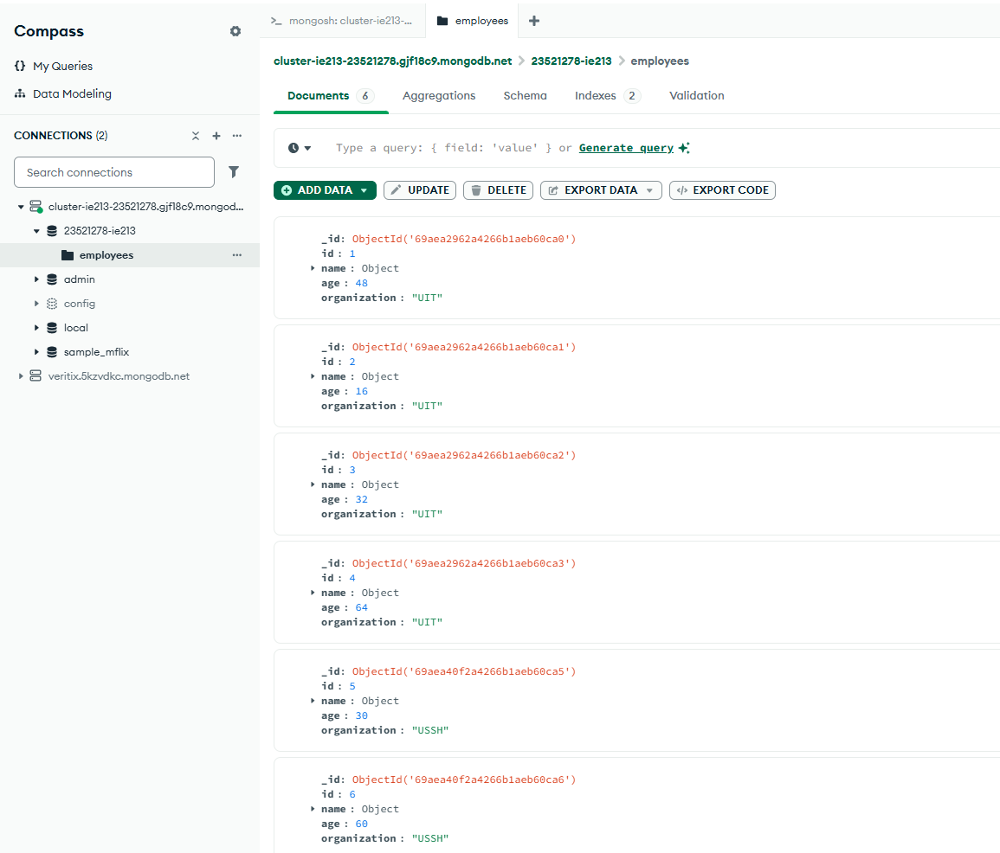

# Thông tin sinh viên

- **Họ và tên:** Dương Nguyễn Nhật Quang  
- **MSSV:** 23521278  
- **Lớp:** IE213.Q21  

---

# Danh sách các Lab

## Lab01
**Nội dung:**  
Tiến hành cài đặt MongoDB và thực hiện một số thao tác CRUD cơ bản.

**Cách chạy:**  
- Dùng Mongosh của MongoDB Compass. 
- Copy và paste script trong README.md ở thư mục Lab01 để chạy.

**Trạng thái:** Đã hoàn thành tất cả nội dung.

